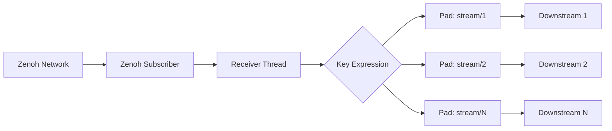

# GStreamer Zenoh Plugin Architecture

This document provides a comprehensive overview of the gst-plugin-zenoh architecture, explaining how the plugin integrates GStreamer with Zenoh for distributed media streaming.

## Table of Contents

- [Overview](#overview)
- [Plugin Structure](#plugin-structure)
- [Component Architecture](#component-architecture)
- [Data Flow](#data-flow)
- [State Management](#state-management)
- [Error Handling](#error-handling)
- [Configuration System](#configuration-system)
- [Threading Model](#threading-model)
- [Integration Points](#integration-points)

## Overview

The GStreamer Zenoh plugin enables GStreamer pipelines to send and receive media data over the network using the [Zenoh](https://zenoh.io/) protocol. Zenoh provides a unified data plane for IoT, edge computing, and cloud applications with features like:

- **Publish/Subscribe messaging**: Decoupled communication between producers and consumers
- **Efficient networking**: Optimized for low latency and high throughput
- **Automatic discovery**: Dynamic peer discovery and routing
- **Quality of Service**: Configurable reliability, priority, and congestion control

The plugin consists of three main elements:
- **`zenohsink`**: Publishes GStreamer data to Zenoh network
- **`zenohsrc`**: Subscribes to Zenoh data and provides it to GStreamer pipelines
- **`zenohdemux`**: Demultiplexes Zenoh streams by key expression, creating dynamic source pads

## Plugin Structure

```
src/
├── lib.rs                  # Plugin registration, entry point, and re-exports
├── utils.rs                # Shared utilities and runtime management
├── error.rs                # Error types and handling
├── metadata.rs             # Buffer metadata transmission (PTS, DTS, duration, flags)
├── compression.rs          # Optional compression support (zstd, lz4, gzip)
├── zenohsink/
│   ├── mod.rs             # ZenohSink element definition, registration, and public API
│   └── imp.rs             # ZenohSink implementation (BaseSink)
├── zenohsrc/
│   ├── mod.rs             # ZenohSrc element definition, registration, and public API
│   └── imp.rs             # ZenohSrc implementation (PushSrc)
└── zenohdemux/
    ├── mod.rs             # ZenohDemux element definition, registration, and public API
    └── imp.rs             # ZenohDemux implementation (Element with dynamic pads)
```

### Module Responsibilities

- **`lib.rs`**: Plugin entry point, registers elements with GStreamer, re-exports main types
- **`utils.rs`**: Shared utilities, currently minimal but extensible
- **`error.rs`**: Centralized error handling with domain-specific error types
- **`metadata.rs`**: Buffer metadata serialization/deserialization for timing preservation
- **`compression.rs`**: Optional compression algorithms (feature-gated)
- **`zenohsink/`**: Sink element that publishes data to Zenoh
- **`zenohsrc/`**: Source element that receives data from Zenoh
- **`zenohdemux/`**: Demultiplexer element with dynamic source pads per key expression

## Component Architecture

### ZenohSink Architecture

```
GStreamer Pipeline → ZenohSink → Zenoh Session → Zenoh Publisher → Network
```

**Key Components:**

1. **BaseSink Implementation**: Inherits from `gst_base::BaseSink` for standard sink behavior
2. **Settings**: Thread-safe configuration storage (`Mutex<Settings>`)
3. **State**: Runtime state management (`Mutex<State>`)
4. **Zenoh Publisher**: Handles data publication to Zenoh network

**State Transitions:**
- `Stopped` → `Started`: Creates Zenoh session and publisher
- `Started` → `Stopped`: Cleans up resources (automatic via Drop)

### ZenohSrc Architecture

```
Network → Zenoh Subscriber → Zenoh Session → ZenohSrc → GStreamer Pipeline
```

**Key Components:**

1. **PushSrc Implementation**: Inherits from `gst_base::PushSrc` for active source behavior
2. **Settings**: Thread-safe configuration storage (`Mutex<Settings>`)
3. **State**: Runtime state management (`Mutex<State>`)
4. **Zenoh Subscriber**: Receives data from Zenoh network using FIFO channel handler

**State Transitions:**
- `Stopped` → `Started`: Creates Zenoh session and subscriber
- `Started` → `Stopped`: Cleans up resources (automatic via Drop)

### ZenohDemux Architecture

```
Network → Zenoh Subscriber → ZenohDemux → Dynamic Source Pads → GStreamer Pipeline(s)
```

**Key Components:**

1. **Element Implementation**: Extends `gst::Element` for dynamic pad management
2. **Settings**: Thread-safe configuration storage (`Mutex<Settings>`)
3. **State**: Runtime state with pad tracking (`Mutex<State>`)
4. **Dynamic Pads**: Creates source pads per unique key expression
5. **Receiver Thread**: Background thread for Zenoh subscription processing

**State Transitions:**
- `Stopped` → `Started`: Creates Zenoh session, subscriber, and receiver thread
- `Started` → `Stopped`: Signals thread shutdown, cleans up resources

**Pad Naming Strategies:**
- `full-path`: Uses complete key expression as pad name
- `last-segment`: Uses only the last segment of the key expression
- `hash`: Uses a hash of the key expression for compact names

## Data Flow

### Sink Data Flow

```mermaid
graph LR
    A[GStreamer Buffer] --> B[render()]
    B --> C[Map Buffer]
    C --> D[Zenoh Publisher]
    D --> E[publisher.put()]
    E --> F[Zenoh Network]
```

**Steps:**
1. GStreamer calls `render()` with a `gst::Buffer`
2. Buffer is mapped to readable memory
3. Raw bytes are extracted from buffer
4. Zenoh publisher sends data using synchronous `put().wait()`
5. Data propagates through Zenoh network to subscribers

### Source Data Flow

```mermaid
graph LR
    A[Zenoh Network] --> B[Zenoh Subscriber]
    B --> C[subscriber.recv()]
    C --> D[create()]
    D --> E[Zenoh Sample]
    E --> F[Extract Payload]
    F --> G[Create GStreamer Buffer]
    G --> H[GStreamer Pipeline]
```

**Steps:**
1. Zenoh subscriber receives data from network
2. `create()` is called by GStreamer
3. `subscriber.recv()` retrieves next sample (blocking)
4. Sample payload is extracted as bytes
5. New `gst::Buffer` is created with payload data
6. Buffer is passed to downstream GStreamer elements

### Demux Data Flow



**Steps:**
1. Zenoh subscriber receives samples with different key expressions
2. Receiver thread processes incoming samples
3. For each unique key expression, a new source pad is created dynamically
4. Sample payload is extracted and wrapped in `gst::Buffer`
5. Buffer is pushed to the corresponding source pad
6. Each downstream pipeline receives only its relevant data

## State Management

### State Enum Design

Both elements use a simple state enum:

```rust
enum State {
    Stopped,                    // Initial state, no resources allocated
    Started(Started),           // Active state with Zenoh resources
}

struct Started {
    session: zenoh::Session,    // Zenoh session (kept for ownership)
    publisher: zenoh::Publisher, // or subscriber for ZenohSrc
}
```

### State Transition Logic

**Start Sequence:**
1. Validate configuration (key expression required)
2. Load Zenoh configuration (file or default)
3. Create Zenoh session using `zenoh::open(config).wait()`
4. Create publisher/subscriber using `session.declare_*().wait()`
5. Store resources in `Started` state

**Stop Sequence:**
1. Replace state with `Stopped`
2. Resources automatically cleaned up via `Drop` implementations
3. No explicit cleanup code needed

### Thread Safety

- All shared state protected by `Mutex`
- Lock acquisition order prevents deadlocks
- Short critical sections minimize contention
- No shared mutable state between elements

## Error Handling

### Error Type Hierarchy

```rust
#[derive(Debug, thiserror::Error)]
pub enum ZenohError {
    #[error("Zenoh initialization error: {0}")]
    InitError(#[from] zenoh::Error),
    
    #[error("Key expression error: {0}")]
    KeyExprError(String),
    
    #[error("Publish error: {0}")]
    PublishError(#[from] zenoh::PublishError),
    
    #[error("Receive error: {0}")]
    ReceiveError(String),
}
```

### Error Propagation

1. **Zenoh Errors** → `ZenohError` → `gst::ErrorMessage` → GStreamer
2. **Network Detection**: Specific handling for timeout/connection errors
3. **User-Friendly Messages**: Clear error descriptions for common issues
4. **Proper Error Classification**: Resource, settings, or stream errors

### Error Recovery

- **Session Failures**: Element transitions to error state
- **Network Issues**: Logged as resource errors
- **Configuration Errors**: Validated during property setting
- **Runtime Errors**: Propagated to GStreamer bus

## Configuration System

### Property System

Both elements expose identical properties for consistency:

| Property | Type | Description | Default |
|----------|------|-------------|---------|
| `key-expr` | String | Zenoh key expression | `""` (required) |
| `config` | String | Zenoh config file path | `None` |
| `priority` | Int | Message priority (-100 to 100) | `0` |
| `congestion-control` | String | `"block"` or `"drop"` | `"block"` |
| `reliability` | String | `"reliable"` or `"best-effort"` | `"best-effort"` |

### Configuration Loading

```rust
let config = match config_file {
    Some(path) if !path.is_empty() => {
        zenoh::Config::from_file(&path)?
    }
    _ => zenoh::Config::default(),
};
```

### Property Validation

- **Key Expression**: Must not be empty
- **Config File**: Path existence checked by Zenoh
- **Enum Values**: Validated against known options
- **Priority Range**: Clamped to valid bounds

## Threading Model

### Simplified Architecture

The plugin uses a **simplified synchronous model**:

- **No Background Threads**: All operations use Zenoh's synchronous API
- **No Async Runtime**: Removed Tokio dependency for simplicity
- **Blocking Operations**: Use `.wait()` for synchronous operation
- **GStreamer Threading**: Relies on GStreamer's thread management

### Thread Safety Guarantees

- **Mutex Protection**: All mutable state protected
- **Send + Sync**: All shared types implement thread safety traits
- **No Data Races**: Careful lock ordering prevents deadlocks
- **Resource Cleanup**: Automatic via Rust's ownership system

## Integration Points

### GStreamer Integration

**Element Registration:**
```rust
fn plugin_init(plugin: &gst::Plugin) -> Result<(), glib::BoolError> {
    zenohsink::register(plugin)?;
    zenohsrc::register(plugin)?;
    zenohdemux::register(plugin)?;
    Ok(())
}
```

**Base Class Integration:**
- `zenohsink`: Extends `gst_base::BaseSink`
- `zenohsrc`: Extends `gst_base::PushSrc`
- `zenohdemux`: Extends `gst::Element` (for dynamic pad support)

### Zenoh Integration

**Session Management:**
```rust
// Synchronous session creation
let session = zenoh::open(config).wait()?;

// Publisher/Subscriber creation
let publisher = session.declare_publisher(key_expr).wait()?;
let subscriber = session.declare_subscriber(key_expr).wait()?;
```

**Data Operations:**
```rust
// Publishing (zenohsink)
publisher.put(data).wait()?;

// Receiving (zenohsrc)
let sample = subscriber.recv()?;
```

### Caps Integration

- **Any Caps**: Elements accept/produce any media type
- **No Negotiation**: Pass-through caps handling
- **Format Preservation**: Raw byte transmission preserves all data

## Strongly-Typed Rust API

The plugin provides a strongly-typed Rust API for programmatic use, in addition to the standard GStreamer property-based API.

### Main Types

All main types are re-exported at the crate root for convenience:

```rust
use gstzenoh::{ZenohSink, ZenohSinkBuilder, ZenohSrc, ZenohSrcBuilder, ZenohDemux, ZenohDemuxBuilder, PadNaming};
```

### Construction Patterns

**Simple Constructor:**
```rust
let sink = ZenohSink::new("demo/video");
```

**Builder Pattern:**
```rust
let sink = ZenohSink::builder("demo/video")
    .reliability("reliable")
    .priority(5)
    .express(true)
    .build();
```

### Typed Getters and Setters

Each element provides typed methods instead of requiring property strings:

```rust
// Setters
sink.set_key_expr("demo/video");
sink.set_reliability("reliable");
sink.set_express(true);

// Getters
let key: String = sink.key_expr();
let bytes: u64 = sink.bytes_sent();
let messages: u64 = sink.messages_sent();
```

### Type Conversion

Convert from `gst::Element` to strongly-typed wrapper:

```rust
use std::convert::TryFrom;

let element: gst::Element = /* ... */;
let sink = ZenohSink::try_from(element).expect("Should be a ZenohSink");
```

## Usage Patterns

### Basic Pipeline

```bash
# Sender
gst-launch-1.0 videotestsrc ! zenohsink key-expr=video/stream

# Receiver
gst-launch-1.0 zenohsrc key-expr=video/stream ! autovideosink
```

### Complex Pipeline

```bash
# With encoding
gst-launch-1.0 videotestsrc ! videoconvert ! x264enc ! \
  zenohsink key-expr=encoded/video

# With decoding
gst-launch-1.0 zenohsrc key-expr=encoded/video ! \
  decodebin ! videoconvert ! autovideosink
```

### Demultiplexing Multiple Streams

```bash
# Subscribe to wildcard pattern and demux by key expression
gst-launch-1.0 zenohdemux key-expr="sensors/**" pad-naming=last-segment ! \
  queue ! filesink location=sensor_data.bin
```

### Configuration Examples

```bash
# With config file
gst-launch-1.0 videotestsrc ! \
  zenohsink key-expr=video config=/path/to/zenoh.json5

# With QoS settings
gst-launch-1.0 videotestsrc ! \
  zenohsink key-expr=video reliability=reliable priority=5
```

## Performance Considerations

### Optimization Strategies

1. **Zero-Copy**: Minimize buffer copying where possible
2. **Efficient Serialization**: Direct byte transmission
3. **Resource Pooling**: Future enhancement for buffer management
4. **Network Efficiency**: Leverage Zenoh's optimized transport

### Current Limitations

- **Buffer Copies**: Some copying unavoidable in current design
- **Synchronous API**: May limit throughput vs async operations
- **No Compression**: Raw data transmission (can be added upstream)

### Future Optimizations

- **Buffer Management**: Custom allocators and pooling
- **Metadata Support**: Zenoh metadata for additional information
- **Compression**: Integration with GStreamer compression elements
- **Statistics**: Performance monitoring and reporting

## Testing Architecture

### Test Structure

```
tests/
├── plugin_tests.rs        # Basic plugin functionality
├── integration_tests.rs   # Cross-element integration
├── uri_handler_tests.rs   # URI parsing, buffer metadata properties
├── statistics_tests.rs    # Statistics properties
└── zenohdemux_tests.rs    # Demux element tests
```

### Test Categories

1. **Unit Tests**: Individual element behavior
2. **Property Tests**: Configuration validation
3. **State Tests**: State transition handling
4. **Integration Tests**: End-to-end pipeline testing
5. **Error Tests**: Error condition handling

This architecture provides a solid foundation for reliable, efficient media streaming over Zenoh networks while maintaining compatibility with the broader GStreamer ecosystem.